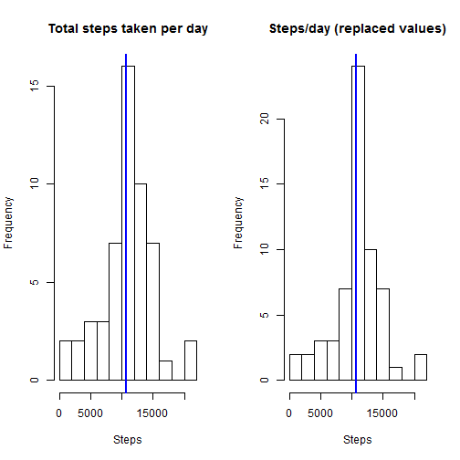

#REPRODUCIBLE RESEARCH. ASSIGNMENT 1

##INTRODUCTION

This assignment makes use of data from a personal activity monitoring device. This device collects data at 5 minute intervals through out the day. The data consists of two months of data from an anonymous individual collected during the months of October and November, 2012 and include the number of steps taken in 5 minute intervals each day.

This document presents the results of the Reproducible Research's Peer Assessment 1 in a report using a single R markdown document that can be processed by knitr and be transformed into an HTML file.

Through this report you can see that activities on weekdays mostly follow a work related routine, also we can find more intense activity in the little spare time the employee has.

An important consideration is the fact that our data presents a t-student distribution (see both histograms). Therefore, the impact of imputing missing values with the mean has a good impact on our predictions, without a significant distortion in the distribution of the data.

##1.LOADING AND PROCESSING THE DATA
This assignment instructions request to show any code that is needed for loading and preprocessing the data. The steps to follow are:

###1.1. Preparing the R environment
First of all, we must load the needed libraries for the assignment. Moreover, throughout this report when writing code chunks in the R markdown document, always use echo = TRUE so that someone else will be able to read the code.

We set echo equal a TRUE and results equal "hold" as global options for this document.


```r
library(data.table)
library(knitr)
opts_chunk$set(echo=TRUE, results="hold")
```

###1.2. Setting the working directory

```r
setwd("C:/Users/ftorrent/RepData_PeerAssessment1")
```

###1.3. Loading the data

```r
data <- read.csv("C:/Users/ftorrent/RepData_PeerAssessment1/activity.csv", header=TRUE, sep=",", stringsAsFactors=FALSE)
```

###1.4. Transforming the data into a suitable format for the analysis:
The 3rd column of the dataset is a date, so we have to convert this variable to date class:

```r
data$date<-as.Date(data$date, format="%Y-%m-%d")
```

Now, we check our variables using the str() command, to see that everthing is what it is supposed to be:

```r
str(data)
```

```
## 'data.frame':	17568 obs. of  3 variables:
##  $ steps   : int  NA NA NA NA NA NA NA NA NA NA ...
##  $ date    : Date, format: "2012-10-01" "2012-10-01" ...
##  $ interval: int  0 5 10 15 20 25 30 35 40 45 ...
```
Thus, we can see that date is formatted correctly.

##2. WHICH IS THE TOTAL NUMBER OF STEPS TAKEN PER DAY?
We ommit the missing values:

```r
data_without <- data[which(!is.na(data$steps)),]
```
The number of steps taken is measured in timeslots of 5-minute intervals, so in order to compute the total number of steps taken each day we will aggregate the data by day.

```r
steps_by_day<-tapply(data_without$steps, data_without$date, sum)
```

###2.1. Histogram
Now, we create the histogram with the new vector we created (steps_by_day):

```r
hist(steps_by_day,10, main = "Total steps taken per day", xlab = "")
```

 

###2.2. Mean and Median
We calculate the mean and median of the total number of steps taken every day:

```r
mean_without <- mean(steps_by_day)
mean_without
```

```
## [1] 10766.19
```

```r
median_without <- median(steps_by_day)
median_without
```

```
## [1] 10765
```
So we can clearly see that the mean is around 10766 and that the median is 10765.

##3. AVERAGE DAILY ACTIVITY PATTERN

###3.1. Time Series Plot
Make a time series plot of the 5-minute interval (x-axis) and the average number of steps taken, averaged across all days (y-axis).

To do that, we Calculate the mean of steps by intervals of 5-minutes and save the data in a variable called steps_per_interval and plot it.


```r
steps_per_interval <- tapply(data_without$steps, data_without$interval, mean)
plot(y = steps_per_interval, x = names(steps_per_interval), type = "l", xlab = "5-Minute-Interval", 
    main = "Daily Activity Pattern", ylab = "Average number of steps")
```

 

###3.2. Which 5-minute interval, on average across all the days in the dataset, contains the maximum number of steps?


```r
steps_per_interval[steps_per_interval==max(steps_per_interval)]
```

```
##      835 
## 206.1698
```

As we can see, the maximum average number of steps during the day is in interval 835, with an average of 206 steps per day.

##4. IMPUTING MISSING VALUES

###4.1. Calculate and report the total number of missing values in the dataset.


```r
sum(is.na(data$steps))
```

```
## [1] 2304
```

So we can observe that there are a total of 2304 missing values in the dataset.

###4.2. Devise a strategy for filling in all of the missing values in the dataset.

To populate missing values, a wise approach is to replace them with the mean value at the same interval across days. In most of the cases the median is a better centrality measure than mean, but in our case the total median is not much far away from total mean, and probably we can make the mean and median meet.

###4.3. Create a new dataset that is equal to the original dataset but with the missing data filled in.


```r
data_with <- data
data_with[which(is.na(data_with$steps)),1] <-steps_per_interval[as.character(data_with[which(is.na(data_with$steps)),3])]
```

Remember that our variable steps_per_interval is already populated by the 5 minutes interval means. What we just did is filling the missing values with the 5 minute interval means.

We can check that there are no missing values in the data left, just to be sure:

```r
sum(is.na(data_with))
```

```
## [1] 0
```
So no missing values in the data left. Great.

###4.4. Make a histogram of the total number of steps taken each day, and calculate and report the mean and median total number of steps taken per day. Do these values differ from the estimates from the first part of the assignment? What is the impact of imputing missing data on the estimates of the total daily number of steps?

Let's create a histogram with the new data set, and compare it with the previous histogram:

```r
steps_per_day_with <- tapply(data_with$steps, data_with$date, sum)
```


```r
par(mfrow=c(1,2)) #Plot 2 graphs in 1 row

hist(steps_by_day,10, main = "Total steps taken per day", xlab = "Steps") #Histogram without replaced values (first histogram)

abline(v=median(steps_by_day), col =4, lwd=2)

hist(steps_per_day_with, 10, main="Steps/day (replaced values)", xlab="Steps") #Histogram with replaced values

abline(v=median(steps_per_day_with), col=4, lwd=2)
```

 

At a first glance, we can observe that there is no significant change on how the two datasets differ. Just to be sure, we calculate the mean and median for both datasets and compare them:

```r
mean_with <- mean(steps_per_day_with)
mean_with
```

```
## [1] 10766.19
```


```r
median_with <- median(steps_per_day_with)
median_with
```

```
## [1] 10766.19
```

Our median with replaced values is 10766.19, the same as our mean.

To compare results, we substract the mean_without replaced NA to the mean_with replaced NA:

```r
mean_with - mean_without
median_with - median_without
```

```
## [1] 0
## [1] 1.188679
```

As we can observe by comparing our findings, we observe that while the mean value remains unchanged, the median value has shifted and virtually matches the mean.

Since our data has shown a t-student distribution (see both histograms), it seems that the impact of imputing missing values has increased our peak, but it has not affected negatively our predictions.

##5. DIFFERENCES IN ACTIVITY PATTERNS BETWEEN WEEKDAYS AND WEEKENDS.

###5.1.Creating the right data.

In this part of the assigment, we will create factor variable in the dataset with two levels - "weekday" and "weekend" indicating whether a given date is a weekday or weekend day.


```r
data_with$wd <- weekdays(data_with$date)

data_with$fwd <- as.factor(c("weekend","weekday"))

data_with[data_with$wd == "domingo" | data_with$wd == "sabado",5] <- factor("weekend") #Weekend also dependant on language format.

data_with[!(data_with$wd == "domingo" | data_with$wd == "sabado"),5] <- factor("weekday") #Weekday also dependant on language format
```

Now we will create two aggregated arrays for the total number of steps taken per 5-minute time interval for weekdays and weekends, and make a graph in order to compare and see if there is any difference.


```r
data_with_we <- subset(data_with, fwd == "weekend")

data_with_wd <- subset(data_with, fwd == "weekday")

steps_per_day_we <- tapply(data_with_we$steps, data_with_we$interval, mean)

steps_per_day_wd <- tapply(data_with_wd$steps, data_with_wd$interval, mean)
```

###5.2. Creating a Time-Series plot


```r
par(mfrow=c(2,1))

plot(y = steps_per_day_wd, x = names(steps_per_day_wd), type = "l", xlab = "5 minute inetrval", main = "Daily Activity Pattern on Weekdays", ylab = "Average number of steps", ylim = c(0,250))

plot(y = steps_per_day_we, x = names(steps_per_day_we), type = "l", xlab = "5 minute interval", main = "Daily Activity Pattern on Weekends", ylab = "Average number of steps", ylim = c(0,250))
```

 

From the two graphs, we can clearly see that the distribution throughout the day is quite different than in weekends. First of all, the individual from whom the measurements were taken, seem to wake up at least one hour later at weekends. Another interesting finding is that there is a huge amount of steps taken on weekdays, possibly while going to work or working out, which does not appear on Saturdays or Sundays. Generally, the whole weekend seems to be more evenly distributed with no huge deviations during hours when a normal person is expected to be awake and active. But, we can observe on average more steps during a weekend day, than on a "working" day. So, this individual is currently employed, he/she probably does not take the car to and from work. As far as his/her job is concerned, he/she has not a job where he/she has to walk too much.

Please, once more, keep in mind that the x-axis point labels are the names of the intervals in the dataset. The coding of the interval names is such, so that e.g. 500 should be considered as 5:00am and 1000 as 10:00am, and so on. So, one can consider the x-axis as a full 24-hour-day starting from midnight and ending at the next midnight hour.

